# Tasko Go

Aplicação móvel Flutter para gerenciamento de vendas e tarefas da linha de produtos Tasko. Permite que vendedores gerenciem clientes, produtos, pedidos e agenda de visitas de forma offline-first, com sincronização via API REST.

## Funcionalidades

### Login

Tela de autenticação com e-mail e senha. Suporta visualização da senha e exibe mensagens de erro de credenciais inválidas diretamente na tela. Acesso ao fluxo de recuperação de senha e criação de conta disponível na mesma tela.

<p align="center">
  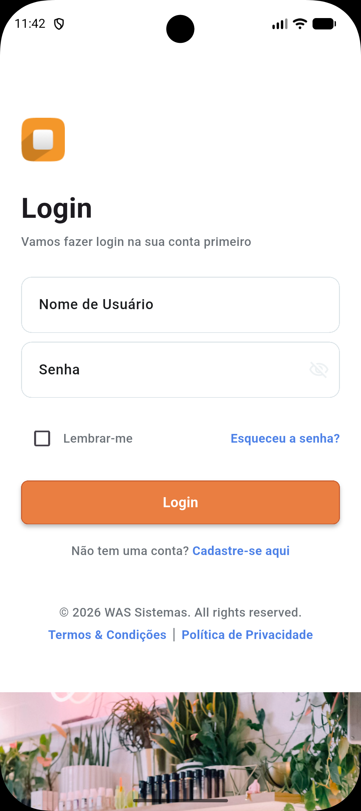

</p>

---

### Recuperar Senha

Fluxo de recuperação de acesso via e-mail cadastrado. O usuário informa o e-mail e recebe as instruções para redefinição da senha.

<p align="center">
  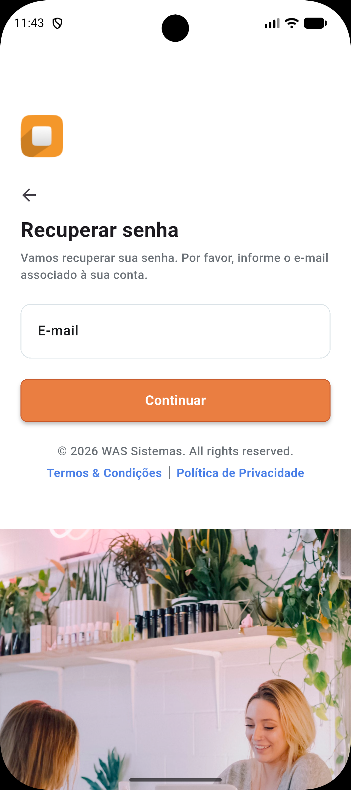
</p>

---

### Criar Conta

Cadastro de novo usuário com campos de nome, e-mail e senha. Validações em tempo real garantem que os dados informados estejam no formato correto antes do envio.

<p align="center">
  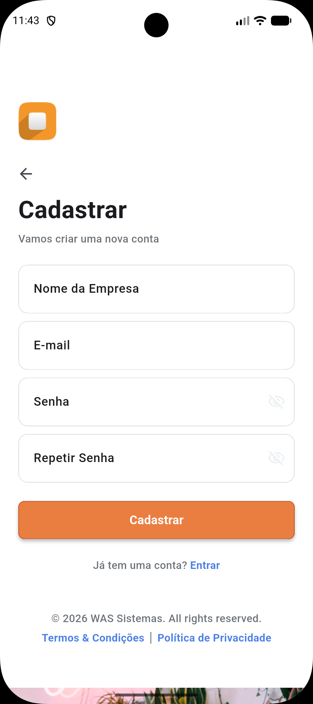
</p>

---

### Menu Principal (Drawer)

Menu lateral com acesso rápido às principais seções do aplicativo: Pedidos, Clientes, Vendedores, Agenda de Visitas e configurações. Exibe informações do usuário autenticado no cabeçalho.

<p align="center">
  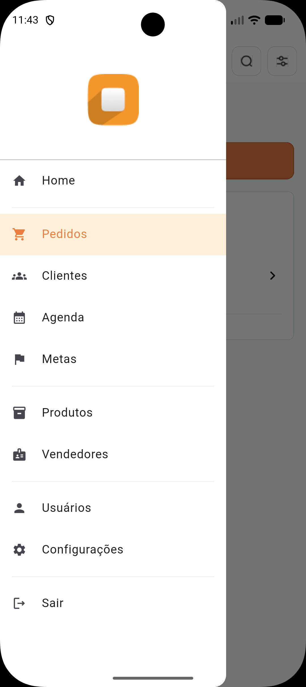
  
</p>

---

### Criação de Pedido

Fluxo guiado em 4 etapas para criação de um novo pedido:

1. **Cliente** — busca e seleção do cliente com exibição do limite disponível e histórico de pedidos.
2. **Produtos** — pesquisa e adição de produtos ao carrinho com controle de quantidade e total em tempo real.
3. **Pagamento** — escolha da forma de pagamento (PIX, Boleto, Cartão), condição (à vista, 30/60/90 dias) e número de parcelas.
4. **Revisão** — resumo completo do pedido com possibilidade de editar cada seção antes de confirmar.

<p align="center">
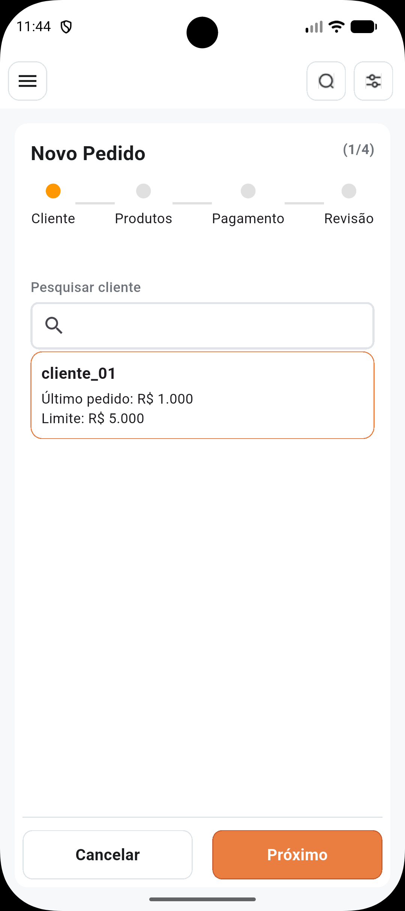
  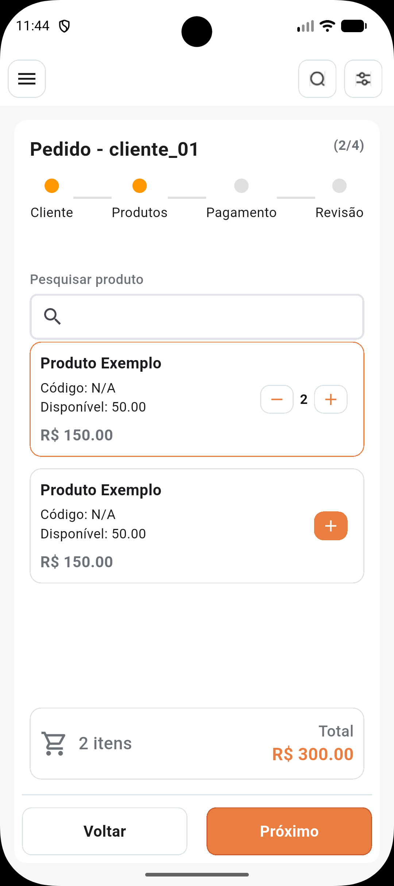
  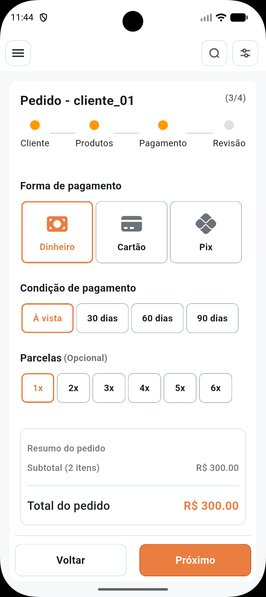
  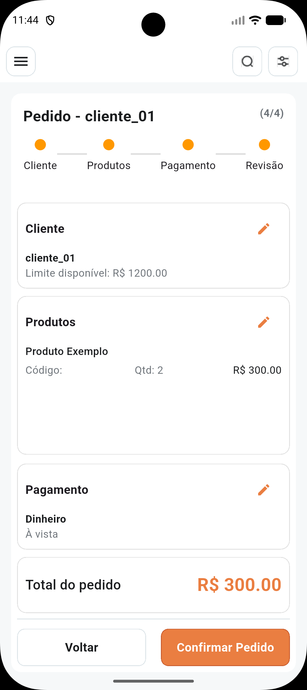

</p>

---

### Listagem de Vendedores

Tela com a lista de vendedores cadastrados, incluindo código, nome, status (ativo/inativo) e indicadores resumidos. Permite busca por nome ou código e acesso rápido ao cadastro de um novo vendedor.

<p align="center">
  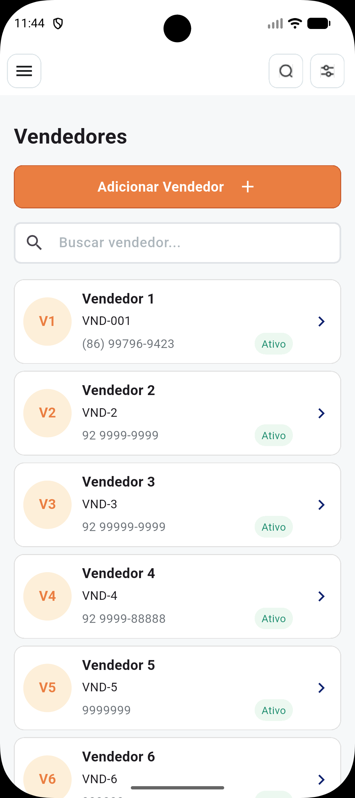

</p>

---

### Manter Vendedor

Cadastro e edição de vendedor organizado em 3 etapas:

1. **Dados Básicos** — código, nome, CPF, status, supervisor e território.
2. **Contato e Meta** — e-mail, telefone, valor da meta mensal e percentual de comissão.
3. **Revisão** — conferência de todos os dados antes de salvar, com atalhos de edição por seção.

<p align="center">
  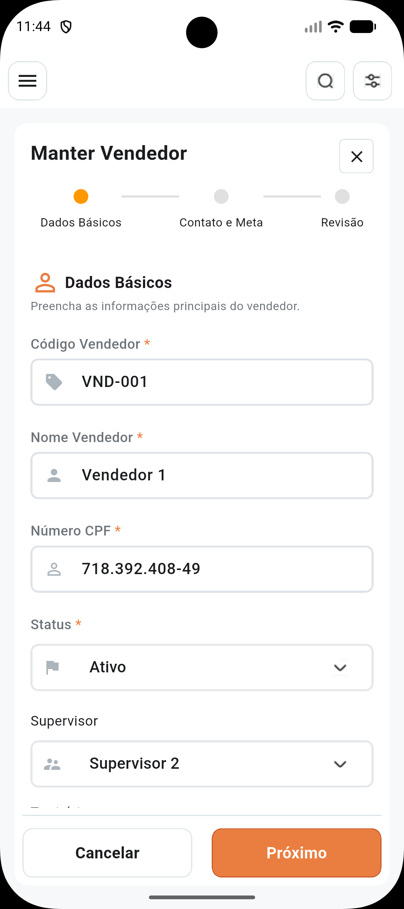
  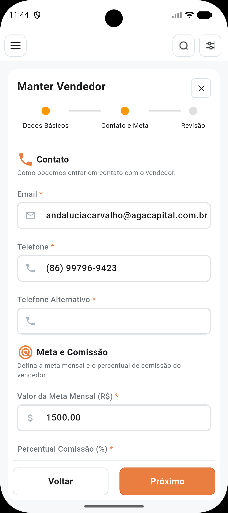
  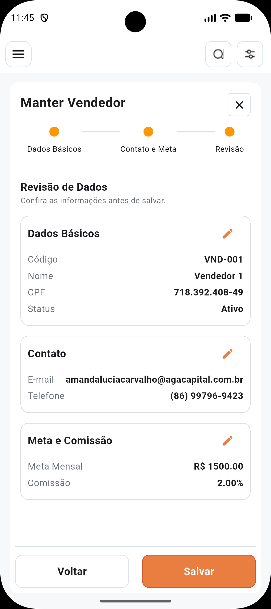
</p>


---

### Metas do Vendedor

Painel de acompanhamento de metas com visão mensal em 4 abas:

1. **Resumo** — visão consolidada de meta financeira, pedidos e clientes novos, além da comissão estimada.
2. **Financeiro** — evolução diária do faturamento no mês com gráfico de linha e comparativo com mês anterior e mesmo mês do ano anterior.
3. **Pedidos e Clientes** — progresso de pedidos realizados, em andamento e clientes novos cadastrados.
4. **Comissão** — cálculo detalhado da comissão com percentual aplicado, base de cálculo e previsão de fechamento do mês.

<p align="center">
  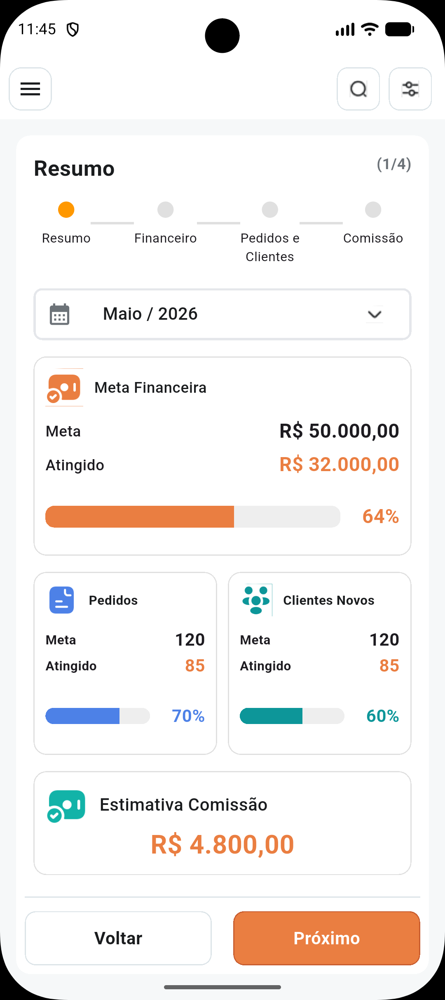
  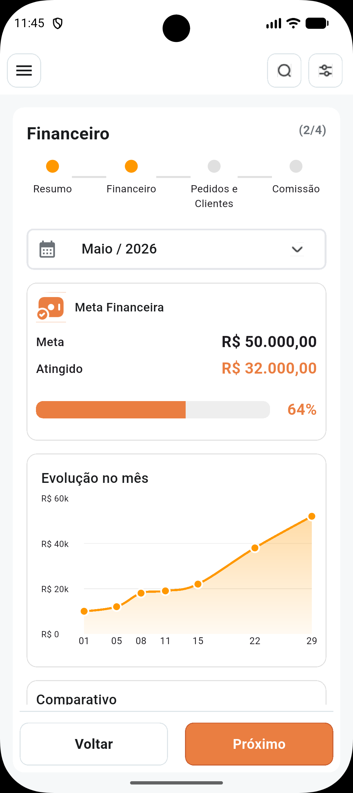
  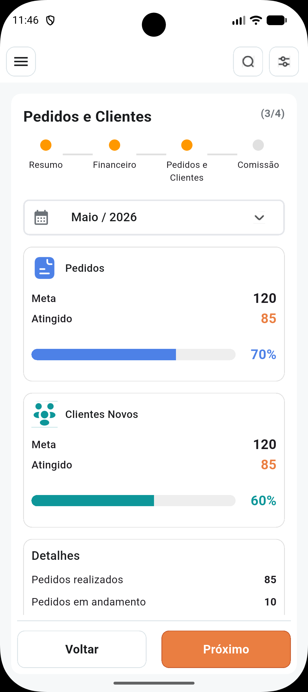
  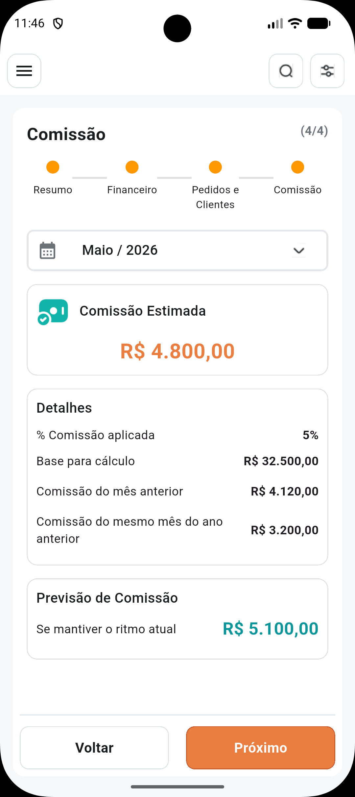
</p>

---

## Stack

| Camada | Tecnologia |
|---|---|
| Framework | Flutter (Dart SDK `^3.10.3`) |
| Gerenciamento de estado | Riverpod `^3.1.0` |
| Navegação | GoRouter `^17.0.1` |
| HTTP | `http ^1.2.2` com cliente customizado (`AuthHttpClient`) |
| Banco local | SQLite via `sqflite ^2.4.2` |
| Variáveis de ambiente | `flutter_dotenv ^6.0.0` (arquivo `.env`) |
| Deep Links | `app_links ^3.4.0` |
| Serialização | `json_annotation` + `json_serializable` + `build_runner` |

## Requisitos

- Flutter `>=3.10.3` (inclui Dart SDK compatível)
- Android SDK (para build Android)
- Xcode 15+ e CocoaPods (para build iOS/macOS)
- Node.js não é necessário

Verifique o ambiente:

```bash
flutter doctor
```

## Setup

### 1. Dependências

```bash
flutter pub get
```

### 2. Geração de código

O projeto usa `json_serializable` para serialização de modelos. Sempre que modificar anotações `@JsonSerializable`, regenere:

```bash
flutter pub run build_runner build --delete-conflicting-outputs
```

Para modo watch durante o desenvolvimento:

```bash
flutter pub run build_runner watch --delete-conflicting-outputs
```

### 3. Variáveis de ambiente da aplicação

Crie um arquivo `.env` na raiz do projeto (já listado nos assets em `pubspec.yaml`):

```dotenv
API_HOST=seu-host-de-api
API_PORT=8080
IS_DEVELOPMENT=true
```

| Variável | Obrigatória | Padrão | Descrição |
|---|---|---|---|
| `API_HOST` | Sim | `localhost` | Endereço do servidor de API |
| `API_PORT` | Não | — | Porta da API (omita para usar sem porta explícita) |
| `IS_DEVELOPMENT` | Não | `false` | Quando `true`, desabilita verificações SSL no cliente HTTP |

O arquivo `.env` é carregado em `main()` via `dotenv.load()` antes de qualquer inicialização de provider.

### 4. iOS (primeira vez)

```bash
cd ios && pod install && cd ..
```

### 5. macOS (primeira vez)

```bash
cd macos && pod install && cd ..
```

## Executando a aplicação

```bash
# Android / iOS / emulador conectado
flutter run

# Escolher dispositivo específico
flutter run -d <device-id>

# Listar dispositivos disponíveis
flutter devices
```

## Qualidade de código

```bash
# Análise estática (flutter_lints)
flutter analyze

# Testes
flutter test
```

## Build

### Android (principal)

**APK de debug:**
```bash
flutter build apk --debug
```

**APK de release:**
```bash
flutter build apk --release
# Saída: build/app/outputs/apk/release/app-release.apk
```

**App Bundle para Google Play:**
```bash
flutter build appbundle --release
# Saída: build/app/outputs/bundle/release/app-release.aab
# Requer android/key.properties configurado (veja seção de release abaixo)
```

### Outras plataformas

```bash
flutter build ios --release       # Requer Xcode + provisioning profiles
flutter build web --release       # Saída: build/web/
flutter build macos --release     # Requer CocoaPods
flutter build linux --release
flutter build windows --release
```

## Android Release Signing

O projeto Android lê as credenciais de assinatura de `android/key.properties`, que é ignorado pelo Git.

**1. Gerar o keystore de upload:**

```bash
keytool -genkey -v \
  -keystore android/upload-keystore.jks \
  -keyalg RSA -keysize 2048 -validity 10000 \
  -alias upload
```

**2. Criar `android/key.properties` a partir do exemplo:**

```bash
cp android/key.properties.example android/key.properties
```

```properties
storeFile=upload-keystore.jks
storePassword=YOUR_STORE_PASSWORD
keyAlias=upload
keyPassword=YOUR_KEY_PASSWORD
```

**3. Gerar o App Bundle assinado:**

```bash
flutter build appbundle --release
```

## Publicação no Google Play (automação local)

O repositório inclui um script local para build do AAB assinado e upload para o Google Play.

### Pré-requisitos

1. O app já deve existir no Google Play Console para o pacote `br.com.wsilva.tasko.go`.
2. `android/key.properties` e o keystore devem estar configurados.
3. Instalar fastlane:

```bash
brew install fastlane
```

4. Criar uma service account no Google Cloud, habilitar a API **Google Play Android Developer** e vinculá-la ao Google Play Console em **Configuração > Acesso à API**.
5. Conceder permissão de upload de releases para a service account no Play Console.

### Configuração local

```bash
cp .env.play.example .env.play
```

Edite `.env.play` e defina ao menos `FL_SERVICE_ACCOUNT_PATH`:

```dotenv
FL_SERVICE_ACCOUNT_PATH=$HOME/.tasko/service-account.json
FL_PACKAGE_NAME=br.com.wsilva.tasko.go
FL_TRACK=internal
FL_AAB_PATH=build/app/outputs/bundle/release/app-release.aab
FL_SKIP_BUILD=0
```

### Publicar

```bash
./scripts/publish_android_play.sh
```

O script executa em sequência: carregar `.env.play` → `flutter pub get` → `flutter build appbundle --release` → upload via fastlane.

Para reutilizar um AAB já compilado:

```bash
FL_SKIP_BUILD=1 ./scripts/publish_android_play.sh
```

### O que o script **não** faz

- Criar o app no Play Console
- Configurar grupos de testadores
- Preencher formulários de acesso, classificação de conteúdo ou ficha da loja

## Arquitetura

O projeto segue uma arquitetura em camadas dentro de `lib/`:

```
lib/
├── main.dart              # Ponto de entrada (bootstrap, dotenv, DeepLinkService)
├── config/                # Configuração da API (leitura de variáveis de ambiente)
├── domain/                # Entidades e contratos de repositório
├── data/                  # Implementações de repositórios e serviços HTTP/SQLite
├── ui/feature/            # Telas organizadas por domínio (MVVM com Riverpod)
│   ├── autenticacao/      # Login, criar conta, recuperar/redefinir senha
│   ├── cliente/           # Listagem, cadastro e edição de clientes
│   ├── produto/           # Catálogo de produtos
│   ├── pedido/            # Criação e listagem de pedidos (multi-step)
│   ├── agenda_visita/     # Agendamento e detalhe de visitas
│   └── vendedor/          # Perfil e seleção de vendedor
├── routing/               # GoRouter (rota inicial: /login; deep link: /reset-password)
├── common/                # Componentes compartilhados (widgets, cores, exceções)
└── util/                  # DeepLinkService, extensões, utilitários de data
```

Cada feature em `ui/feature/` segue o padrão: `*_screen.dart` → `*_view_model.dart` → `*_ui_state.dart` → `*_controllers.dart`.

## Deep Links

O app processa o link `reset-password` via `app_links`. Quando a URI `/reset-password?token=<token>` é recebida, o `DeepLinkService` encaminha para a tela de redefinição de senha.

## Versionamento

`versionName` e `versionCode` no Android (e equivalentes no iOS) são lidos diretamente do campo `version` em `pubspec.yaml`:

```yaml
version: 1.0.0+13
#        ^-----^ versionName
#               ^^ versionCode
```

Para incrementar, altere esse campo antes de gerar o build de release.
